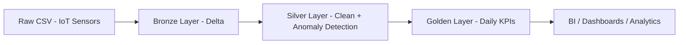
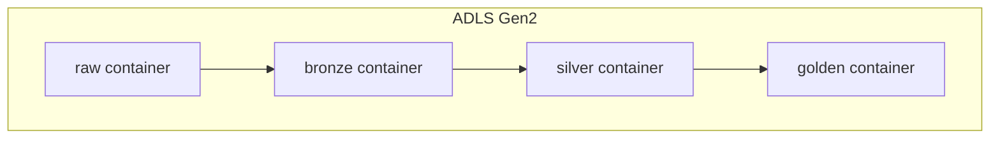
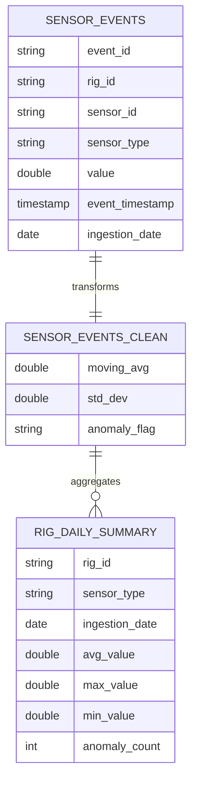
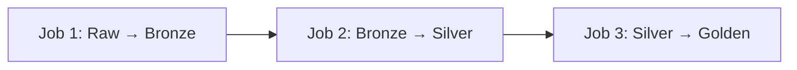

# 🏗️ IoT Tower Maintenance ETL Pipeline
### Arquitectura Medallion en Azure Databricks

*Pipeline automatizado de datos IoT para monitoreo y mantenimiento predictivo de torres industriales, implementando arquitectura Medallion (Bronze, Silver y Gold) con almacenamiento en Delta Lake y despliegue continuo.*

---

## 🎯 Descripción

Pipeline de ingeniería de datos diseñado bajo la Arquitectura Medallion (Bronze → Silver → Golden) implementado en Azure Databricks sobre Delta Lake, utilizando Unity Catalog para gobernanza centralizada.

El proyecto simula un entorno de Industrial IoT Predictive Maintenance, procesando eventos de sensores en rigs industriales:

Temperatura

Presión

Vibración

Flujo

Se aplican métricas estadísticas avanzadas (moving average y desviación estándar) para detectar anomalías operativas en tiempo casi real.

🏗️ Arquitectura General

🔄 Flujo de Datos

🏛️ Arquitectura Física en ADLS

Cada capa está registrada en Unity Catalog con su respectiva External Location y control de credenciales.

<table>
<tr>
<td width="33%" valign="top">

### 🥉 Bronze Layer  
**Tabla:** `sensor_events`

**Rol:** Ingesta estructurada y trazable  

**Características:**
- ✔ Esquema explícito y tipado
- ✔ Timestamp técnico de ingesta
- ✔ Particionado por fecha
- ✔ Sin reglas de negocio
- ✔ Preservación completa del dato original

**Propósito:**  
Zona de aterrizaje confiable que actúa como *single source of truth* para reprocesos.

</td>

<td width="33%" valign="top">

### 🥈 Silver Layer  
**Tabla:** `sensor_events_clean`

**Rol:** Calidad, enriquecimiento y lógica analítica  

**Características:**
- ✔ Limpieza y validación de datos
- ✔ Eliminación de valores inválidos
- ✔ Moving Average por ventana temporal
- ✔ Desviación estándar por sensor
- ✔ Clasificación `ANOMALY / NORMAL`

**Propósito:**  
Datos listos para análisis avanzado y detección de comportamiento anómalo.

</td>

<td width="33%" valign="top">

### 🥇 Golden Layer  
**Tabla:** `rig_daily_summary`

**Rol:** Consumo analítico y KPIs de negocio  

**Características:**
- ✔ Agregaciones diarias
- ✔ Promedios, máximos y mínimos
- ✔ Conteo de eventos anómalos
- ✔ Optimizado para BI y dashboards
- ✔ Baja latencia de consulta

**Propósito:**  
Vista ejecutiva para monitoreo operativo y toma de decisiones.

</td>
</tr>
</table>

🧠 Detección de Anomalías

value > moving_avg + 3 * std_dev

Donde:

- moving_avg = media móvil de 10 eventos

- std_dev = desviación estándar en la ventana

- Regla de 3 sigmas para detección outliers

Esto permite identificar comportamiento anómalo por:

- rig_id

- sensor_id

- orden temporal

📊 Modelo de Datos

📁 Estructura del Proyecto
iot-predictive-maintenance/
iot-predictive-maintenance/
├── README.md
├── environment/
│   ├── 00_create_catalog_and_schemas.sql
│   ├── 01_create_external_locations.sql
│   └── 02_create_tables.sql
├── bronze/
│   └── 10_raw_to_bronze_sensor_events.py
├── silver/
│   └── 20_bronze_to_silver_sensor_events.py
├── golden/
│   └── 30_silver_to_golden_rig_daily_summary.py
├── jobs/
│   ├── raw_to_bronze_job.json
│   ├── bronze_to_silver_job.json
│   └── silver_to_golden_job.json
├── workflows/
│   └── iot_predictive_maintenance_workflow.json
├── data/
│   └── sample/
│       └── sensor_events_sample.csv
└── utils/
    ├── schemas.py
    └── constants.py
🔐 Gobernanza y Seguridad

Implementado con:

 - Unity Catalog

 - xternal Locations por capa

 - Storage Credentials centralizadas

 - Separación Infraestructura vs Procesamiento

Principio aplicado:

Infraestructura (DDL) ≠ Procesamiento (DML)

Los jobs no crean tablas.
Solo insertan datos.

Arquitectura enterprise real.

Pipeline compuesto por 3 Jobs dependientes:

⚙️ Requisitos Previos

☁️ Plataforma y Accesos

- Cuenta de Azure con permisos para crear y administrar recursos

-Azure Databricks con workspace operativo

-Cluster activo en Databricks

 -Nombre sugerido: Cluster1

 -Runtime compatible con Spark 3.x

📦 Almacenamiento

- Azure Data Lake Storage Gen2 configurado

- Contenedores separados por capa:

    - raw, bronze, silver, golden

- External Locations y Storage Credentials correctamente definidos

🐙 Control de Versiones

GitHub

- Repositorio inicializado

- Permisos de administrador para configurar ramas y CI/CD (opcional)

📊 Visualización y Análisis

- Power BI Desktop 
Para consumo de KPIs desde la capa Golden

 ⚙️Configurado en Databricks Workflows con:

 - Control de concurrencia

 - Logs detallados

 - Reintentos automáticos

 - Parametrización vía JSON
   

🧪 Validaciones Implementadas
- Esquema explícito
- Filtrado de valores negativos
- Columnas técnicas de auditoría
- Particionado por fecha
- Detección estadística de anomalías

# 📈 Beneficios de la Arquitectura
- Separación clara de responsabilidades
- Escalabilidad horizontal
- ACID transactions con Delta Lake
- Preparado para integración con BI
- Base sólida para evolucionar a streaming
- Gobernanza enterprise-ready

# 🎯 Competencias Demostradas

- Diseño de arquitectura Medallion
- Implementación en entorno cloud Azure
- Gobernanza con Unity Catalog
- Procesamiento distribuido con Spark
- Modelado analítico para mantenimiento predictivo
- Construcción de pipelines productivos

**Características**:
- ✅ Datos tal como vienen de origen
- ✅ Timestamp de ingesta
- ✅ Preservación histórica
- ✅ Sin validaciones

</td>
<td width="33%" valign="top">

#### 🥈 Silver Layer
**Propósito**: Modelo dimensional

**Tablas**:
- category_sales
- product_sales
- store_sales
- store_warranty_status
- warranty_products

**Características**:
- ✅ Star Schema
- ✅ Datos normalizados
- ✅ Validaciones completas

</td>
<td width="33%" valign="top">

#### 🥇 Gold Layer
**Propósito**: Analytics-ready

**Tablas**:
- kpi_category_sales        : Monto total en ventas agrupado por categoría y año
- kpi_product_sales         : Monto total en ventas agrupado por producto y año
- kpi_store_sales           : Monto total en ventas agrupado por tienda y año
- kpi_store_warranty_status : Total de reclamos por tienda en los diferentes estatus pivot
- kpi_product_warranty      : Productos con mayor reclamos post venta (garantía)

**Características**:
- ✅ Pre-agregados
- ✅ Optimizado para BI
- ✅ Performance máximo
- ✅ Actualizaciones automáticas

</td>
</tr>
</table>

---

## 📁 Estructura del Proyecto

iot-predictive-maintenance/
│
├── README.md
│
├── environment/
│   ├── 00_create_catalog_and_schemas.sql
│   ├── 01_create_external_locations.sql
│   └── 02_create_tables.sql
│
├── bronze/
│   └── 10_raw_to_bronze_sensor_events.py
│
├── silver/
│   └── 20_bronze_to_silver_sensor_events.py
│
├── golden/
│   └── 30_silver_to_golden_rig_daily_summary.py
│
├── jobs/
│   ├── raw_to_bronze_job.json
│   ├── bronze_to_silver_job.json
│   └── silver_to_golden_job.json
│
├── workflows/
│   └── iot_predictive_maintenance_workflow.json
│
├── data/
│   └── sample/
│       └── sensor_events_sample.csv
│
└── utils/
    ├── schemas.py
    └── constants.py

---

## 🛠️ Tecnologías

| Tecnología | Propósito |
|:----------:|:----------|
|  | Motor de procesamiento distribuido Spark |
|  | Storage layer con ACID transactions |
|  | Framework de transformación de datos |
|  | Data Lake para almacenamiento persistente |
|  | Automatización CI/CD |
|  |  Visualización |

---

## ⚙️ Requisitos Previos

- ☁️ Cuenta de Azure con acceso a Databricks
- 💻 Workspace de Databricks configurado
- 🖥️ Cluster activo (nombre: Cluster1)
- 🐙 Cuenta de GitHub con permisos de administrador
- 📦 Azure Data Lake Storage Gen2 configurado
- 📊 Power BI Desktop (opcional para visualización)

---

## 🚀 Instalación y Configuración

### 1️⃣ Clonar el Repositorio

bash
git clone https://github.com/guaru/project-databricks.git
cd project-databricks

### 2️⃣ Configurar Databricks Token

1. Ir a Databricks Workspace
2. **User Settings** → **Developer** → **Access Tokens**
3. Click en **Generate New Token**
4. Configurar:
   - **Comment**: GitHub CI/CD
   - **Lifetime**: 90 days
5. ⚠️ Copiar y guardar el token

### 3️⃣ Configurar GitHub Secrets

En tu repositorio: **Settings** → **Secrets and variables** → **Actions**

| Secret Name | Valor Ejemplo |
|------------|---------------|
| DATABRICKS_HOST | https://adb-xxxxx.azuredatabricks.net |
| DATABRICKS_TOKEN | dapi_xxxxxxxxxxxxxxxx |

### 4️⃣ Verificar Storage Configuration

python
storage_path = "abfss://raw@adlsprojectsmartdata.dfs.core.windows.net"

✅ **¡Configuración completa!**

---

## 💻 Uso

### 🔄 Despliegue Automático (Recomendado)

bash
git add .
git commit -m "✨ feat: mejoras en pipeline"
git push origin master

**GitHub Actions ejecutará**:
- 📤 Deploy de notebooks a /Production/ETL-APPLE
- 🔧 Creación del workflow WF_PROD_ETL_APPLE_SALES
- ▶️ Ejecución completa:  Bronze → Silver → Gold
- 📧 Notificaciones de resultados

### 🖱️ Despliegue Manual desde GitHub

1. Ir al tab **Actions** en GitHub
2. Seleccionar **Deploy ETL Apple Sales And Warranty**
3. Click en **Run workflow**
4. Seleccionar rama main
5. Click en **Run workflow**

### 🔧 Ejecución Local en Databricks

Navegar a /Production/ETL-APPLE y ejecutar en orden:

- Enviroment preparation.py         → Crear esquema
- ingest_catalogs.py                → Bronze Layer
- ingest_sales.py                   → Bronze Layer
- ingest_warranty.py                → Bronze Layer
- transform_sales.py                → Silver Layer
- transform_warranty.py             → Silver Layer
- load_sales.py                     → Gold Layer
- load_warranty.py                  → Gold Layer

---

## 🔄 CI/CD

### Pipeline de GitHub Actions

yaml
Workflow: Deploy ETL Apple Sales And Warranty
├── Deploy notebooks → /Production/ETL-APPLE
├── Eliminar workflow antiguo (si existe)
├── Buscar cluster configurado
├── Crear nuevo workflow con 4 tareas
├── Ejecutar pipeline automáticamente
└── Monitorear y notificar resultados

### 🔄  Workflow Databricks

⏰ Schedule: Diario 8:00 AM (Lima)
⏱️ Timeout total: 4 horas
 🔒 Max concurrent runs: 1
⏰ Notificaciones: 
      success: isc.ventura@gmail.com
      failed:  isc.ventura@gmail.com

---

## 📈 Dashboards
https://github.com/guaru/project-databricks/tree/dev/dashboards

## 🔍 Monitoreo

### En Databricks

**Workflows**:
- Ir a **Workflows** en el menú lateral
- Buscar ETL_PROD_APPLE_SALES
- Ver historial de ejecuciones

**Logs por Tarea**:
- Click en una ejecución específica
- Click en cada tarea para ver logs detallados
- Revisar stdout/stderr en caso de errores

### En GitHub Actions

- Tab **Actions** del repositorio
- Ver historial de workflows
- Click en ejecución específica para detalles
- Revisar logs de cada step

---

## 👤 Autor

### Cristian Bohorquez Rodriguez

[]
(cristian.bohorquez.rodriguez@gmail.com)

**Data Engineering** | **Azure Databricks** | **Delta Lake** | **CI/CD**

---

## 📄 Licencia

Este proyecto está bajo la Licencia MIT - ver el archivo [LICENSE](LICENSE) para más detalles.

---

**Proyecto**: Data Engineering - Arquitectura Medallion  
**Tecnología**: Azure Databricks + Delta Lake + CI/CD  
**Última actualización**: 2025

