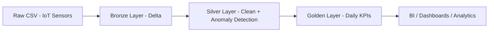
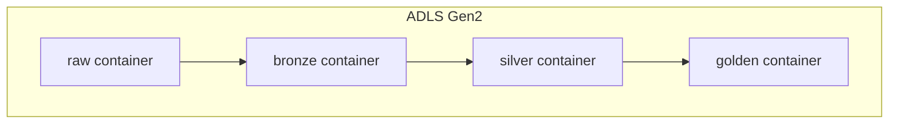
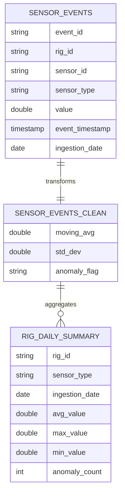
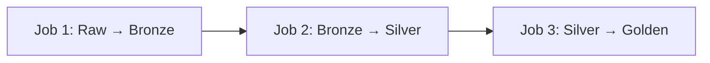

<div align="center">

# 🏗️ IoT Tower Maintenance ETL Pipeline
### Arquitectura Medallion en Azure Databricks

[](https://databricks.com/)
[](https://azure.microsoft.com/)
[](https://spark.apache.org/)
[](https://delta.io/)
[](https://azure.microsoft.com/)
[](https://github.com/features/actions)

*Pipeline automatizado de datos IoT para monitoreo y mantenimiento predictivo de torres industriales, implementando arquitectura Medallion (Bronze, Silver y Gold) con almacenamiento en Delta Lake y despliegue continuo.*

</div>
---

## 🎯 Descripción

Pipeline de ingeniería de datos diseñado bajo la **Arquitectura Medallion** (Bronze → Silver → Gold), implementado en **Azure Databricks** sobre **Delta Lake**, con gobernanza centralizada mediante **Unity Catalog**.

El proyecto simula un entorno de **Industrial IoT Predictive Maintenance**, procesando eventos de sensores en rigs industriales con los siguientes tipos de señales:

| Sensor | Descripción |
|--------|-------------|
| 🌡️ Temperatura | Monitoreo térmico de componentes críticos |
| ⚙️ Presión | Control de presión en sistemas hidráulicos |
| 📳 Vibración | Detección de desgaste mecánico |
| 💧 Flujo | Medición de caudales en tuberías |

Se aplican **métricas estadísticas avanzadas** (moving average y desviación estándar) para detectar anomalías operativas en tiempo casi real.

---

## 🏗️ Arquitectura General

### 🔄 Flujo de Datos

El pipeline sigue un flujo lineal de transformación progresiva desde los datos crudos hasta los KPIs de negocio:



### 🏛️ Arquitectura Física en Azure Data Lake Storage Gen2

Los datos se almacenan en **contenedores independientes por capa** dentro de ADLS Gen2, garantizando aislamiento y control de acceso granular:




Cada capa está registrada en Unity Catalog con su respectiva External Location y control de credenciales.

<table>
<tr>
<td width="33%" valign="top">

### 🥉 Bronze Layer  
**Tabla:** `sensor_events`

**Rol:** Ingesta estructurada y trazable  

**Características:**
- ✔ Esquema explícito y tipado
- ✔ Timestamp técnico de ingesta
- ✔ Particionado por fecha
- ✔ Sin reglas de negocio
- ✔ Preservación completa del dato original

**Propósito:**  
Zona de aterrizaje confiable que actúa como *single source of truth* para reprocesos.

</td>

<td width="33%" valign="top">

### 🥈 Silver Layer  
**Tabla:** `sensor_events_clean`

**Rol:** Calidad, enriquecimiento y lógica analítica  

**Características:**
- ✔ Limpieza y validación de datos
- ✔ Eliminación de valores inválidos
- ✔ Moving Average por ventana temporal
- ✔ Desviación estándar por sensor
- ✔ Clasificación `ANOMALY / NORMAL`

**Propósito:**  
Datos listos para análisis avanzado y detección de comportamiento anómalo.

</td>

<td width="33%" valign="top">

### 🥇 Golden Layer  
**Tabla:** `rig_daily_summary`

**Rol:** Consumo analítico y KPIs de negocio  

**Características:**
- ✔ Agregaciones diarias
- ✔ Promedios, máximos y mínimos
- ✔ Conteo de eventos anómalos
- ✔ Optimizado para BI y dashboards
- ✔ Baja latencia de consulta

**Propósito:**  
Vista ejecutiva para monitoreo operativo y toma de decisiones.

</td>
</tr>
</table>


# 🧠 Detección de Anomalías

El pipeline aplica detección estadística de outliers en la capa Silver usando la **regla de los 3 sigmas**, una técnica ampliamente adoptada en sistemas de monitoreo industrial.

### ¿Cómo funciona la regla de 3 sigmas?

La idea es simple: si un valor de sensor se aleja demasiado del comportamiento reciente — más de 3 desviaciones estándar de la media móvil — se considera **anómalo**. Esto captura picos, caídas bruscas o comportamiento fuera de rango sin necesidad de umbrales fijos hardcodeados.

```python
# Lógica aplicada por sensor en ventana deslizante de 10 eventos
anomaly_flag = (
    "ANOMALY" if value > moving_avg + 3 * std_dev
    else "NORMAL"
)
```

## 📊 Modelo de Datos

El modelo de datos refleja directamente la filosofía de la arquitectura Medallion: **cada tabla es una versión más refinada y valiosa de la anterior**. Los datos no se duplican por capricho — cada capa tiene un propósito claro y añade valor concreto sobre la anterior.

`SENSOR_EVENTS` captura el hecho crudo tal como ocurrió en el sensor. `SENSOR_EVENTS_CLEAN` enriquece ese evento con contexto estadístico que permite clasificarlo. `RIG_DAILY_SUMMARY` colapsa miles de eventos individuales en una vista operativa diaria, optimizada para consumo por equipos de operaciones y BI.




🔐 Gobernanza y Seguridad

Implementado con:

 - Unity Catalog

 - xternal Locations por capa

 - Storage Credentials centralizadas

 - Separación Infraestructura vs Procesamiento

Principio aplicado:

Infraestructura (DDL) ≠ Procesamiento (DML)

Los jobs no crean tablas.
Solo insertan datos.

Arquitectura enterprise real.


Pipeline compuesto por 3 Jobs dependientes:


## ⚙️ Requisitos Previos

### ☁️ Plataforma y Accesos

- Cuenta de **Azure** con permisos para crear y administrar recursos
- Dos workspaces de **Azure Databricks** (DEV y PROD)
- **Azure Data Lake Storage Gen2** con contenedores por capa
- **Unity Catalog** habilitado y configurado
- Cluster activo en Databricks con runtime **Spark 3.x+**
  - Nombre sugerido: `Cluster1`

### 🔑 Variables de Entorno (GitHub Secrets)

```bash
DATABRICKS_HOST_DEV       # URL del workspace de desarrollo
DATABRICKS_TOKEN_DEV      # Token de acceso al workspace DEV
DATABRICKS_HOST_PROD      # URL del workspace de producción
DATABRICKS_TOKEN_PROD     # Token de acceso al workspace PROD
```


---

🔄 Gestión de Entornos con GitHub Actions y Azure Databricks

Este proyecto implementa un flujo de CI/CD que permite gestionar cambios entre el entorno de desarrollo y el entorno de producción de forma controlada y automatizada, utilizando GitHub Actions como orquestador y Azure Databricks como plataforma de procesamiento de datos.
Arquitectura del flujo


¿Cómo funciona?

El proyecto cuenta con dos workspaces de Azure Databricks, uno por entorno:

Entorno de Desarrollo → asociado a la rama contruncion. Aquí se realizan todos los cambios, pruebas y validaciones antes de pasar a producción.
Entorno de Producción → asociado a la rama main. Solo recibe cambios que han pasado satisfactoriamente por el flujo de CI/CD.

El puente entre ambos entornos es GitHub Actions, que se encarga de ejecutar automáticamente las validaciones y despliegues necesarios cuando se hace merge de contruncion hacia main. De esta forma se garantiza que ningún cambio llega a producción sin haber sido revisado y aprobado previamente.
Ventajas de este enfoque

Control de cambios: todo cambio queda registrado en Git, con historial completo y trazabilidad.
Separación de entornos: el workspace de producción nunca se toca directamente, reduciendo el riesgo de errores.
Automatización: GitHub Actions elimina pasos manuales y asegura que el proceso de despliegue sea siempre consistente.
Rollback sencillo: ante cualquier problema, es posible revertir el merge y restaurar el estado anterior.


---

## 👤 Autor

<div align="center">

### Cristian Bohorquez Rodriguez

[](https://www.linkedin.com/in/cristian-bohorquez-b02b9820a/)
[](https://github.com/devcristianbohorquez-droid)
[](mailto:cristian.bohorquez.rodriguez@gmail.com)

**Data Engineering** | **Azure Databricks** | **Delta Lake** | **CI/CD**

</div>

---

## 📄 Licencia

Este proyecto está bajo la **Licencia MIT** — ver el archivo [LICENSE](LICENSE) para más detalles.

---

<div align="center">

**Proyecto:** Data Engineering — Arquitectura Medallion  
**Stack:** Azure Databricks · Delta Lake · Unity Catalog · GitHub Actions  
**Última actualización:** 2026


</div>

