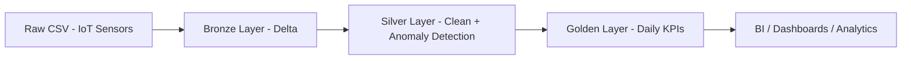
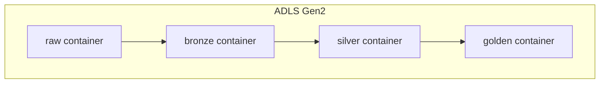
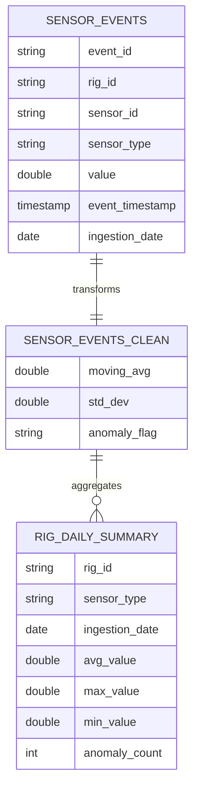
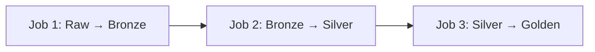

# 🏗️ IoT Tower Maintenance ETL Pipeline
### Arquitectura Medallion en Azure Databricks

*Pipeline automatizado de datos IoT para monitoreo y mantenimiento predictivo de torres industriales, implementando arquitectura Medallion (Bronze, Silver y Gold) con almacenamiento en Delta Lake y despliegue continuo.*

---

## 🎯 Descripción

Pipeline de ingeniería de datos diseñado bajo la Arquitectura Medallion (Bronze → Silver → Golden) implementado en Azure Databricks sobre Delta Lake, utilizando Unity Catalog para gobernanza centralizada.

El proyecto simula un entorno de Industrial IoT Predictive Maintenance, procesando eventos de sensores en rigs industriales:

Temperatura

Presión

Vibración

Flujo

Se aplican métricas estadísticas avanzadas (moving average y desviación estándar) para detectar anomalías operativas en tiempo casi real.

🏗️ Arquitectura General

🔄 Flujo de Datos

🏛️ Arquitectura Física en ADLS

Cada capa está registrada en Unity Catalog con su respectiva External Location y control de credenciales.

<table>
<tr>
<td width="33%" valign="top">

### 🥉 Bronze Layer  
**Tabla:** `sensor_events`

**Rol:** Ingesta estructurada y trazable  

**Características:**
- ✔ Esquema explícito y tipado
- ✔ Timestamp técnico de ingesta
- ✔ Particionado por fecha
- ✔ Sin reglas de negocio
- ✔ Preservación completa del dato original

**Propósito:**  
Zona de aterrizaje confiable que actúa como *single source of truth* para reprocesos.

</td>

<td width="33%" valign="top">

### 🥈 Silver Layer  
**Tabla:** `sensor_events_clean`

**Rol:** Calidad, enriquecimiento y lógica analítica  

**Características:**
- ✔ Limpieza y validación de datos
- ✔ Eliminación de valores inválidos
- ✔ Moving Average por ventana temporal
- ✔ Desviación estándar por sensor
- ✔ Clasificación `ANOMALY / NORMAL`

**Propósito:**  
Datos listos para análisis avanzado y detección de comportamiento anómalo.

</td>

<td width="33%" valign="top">

### 🥇 Golden Layer  
**Tabla:** `rig_daily_summary`

**Rol:** Consumo analítico y KPIs de negocio  

**Características:**
- ✔ Agregaciones diarias
- ✔ Promedios, máximos y mínimos
- ✔ Conteo de eventos anómalos
- ✔ Optimizado para BI y dashboards
- ✔ Baja latencia de consulta

**Propósito:**  
Vista ejecutiva para monitoreo operativo y toma de decisiones.

</td>
</tr>
</table>

🧠 Detección de Anomalías

value > moving_avg + 3 * std_dev

Donde:

- moving_avg = media móvil de 10 eventos

- std_dev = desviación estándar en la ventana

- Regla de 3 sigmas para detección outliers

Esto permite identificar comportamiento anómalo por:

- rig_id

- sensor_id

- orden temporal

📊 Modelo de Datos

🔐 Gobernanza y Seguridad

Implementado con:

 - Unity Catalog

 - xternal Locations por capa

 - Storage Credentials centralizadas

 - Separación Infraestructura vs Procesamiento

Principio aplicado:

Infraestructura (DDL) ≠ Procesamiento (DML)

Los jobs no crean tablas.
Solo insertan datos.

Arquitectura enterprise real.

Pipeline compuesto por 3 Jobs dependientes:

## ⚙️ Requisitos Previos
 
### ☁️ Plataforma y Accesos

- Cuenta de Azure con permisos para crear y administrar recursos
- Azure Databricks con workspace operativo
- Cluster activo en Databricks
- Nombre sugerido: Cluster1
- Runtime compatible con Spark 3.x

### 📦 Almacenamiento

- Azure Data Lake Storage Gen2 configurado
- Contenedores separados por capa:
    - raw, bronze, silver, golden
- External Locations y Storage Credentials correctamente definidos

### 🐙 Control de Versiones
GitHub
- Repositorio inicializado
- Permisos de administrador para configurar ramas y CI/CD (opcional)

###  📊 Visualización y Análisis
- Power BI Desktop 
Para consumo de KPIs desde la capa Golden

## 🚀 Instalación y Configuración

✅ **¡Configuración completa!**

---

---

## 👤 Autor

### Cristian Bohorquez Rodriguez

**Data Engineering** | **Azure Databricks** | **Delta Lake** | **CI/CD**

ad

---

## 📄 Licencia

Este proyecto está bajo la Licencia MIT - ver el archivo [LICENSE](LICENSE) para más detalles.

---

**Proyecto**: Data Engineering - Arquitectura Medallion  
**Tecnología**: Azure Databricks + Delta Lake + CI/CD  
**Última actualización**: 2026

